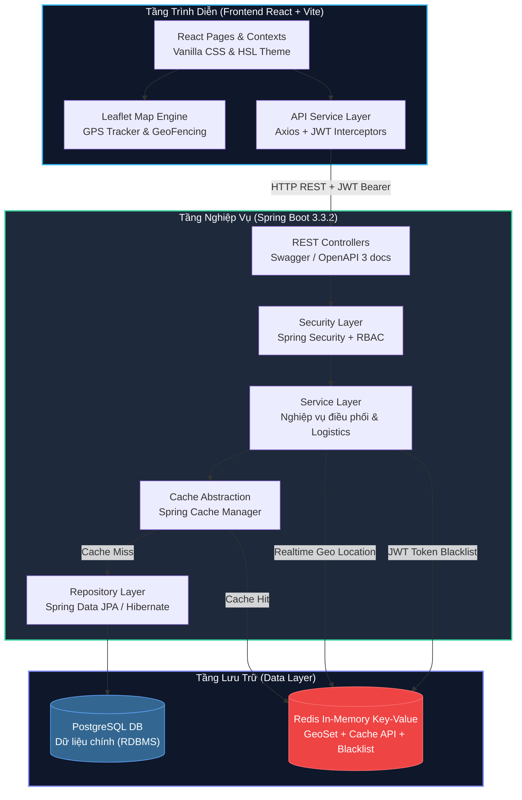
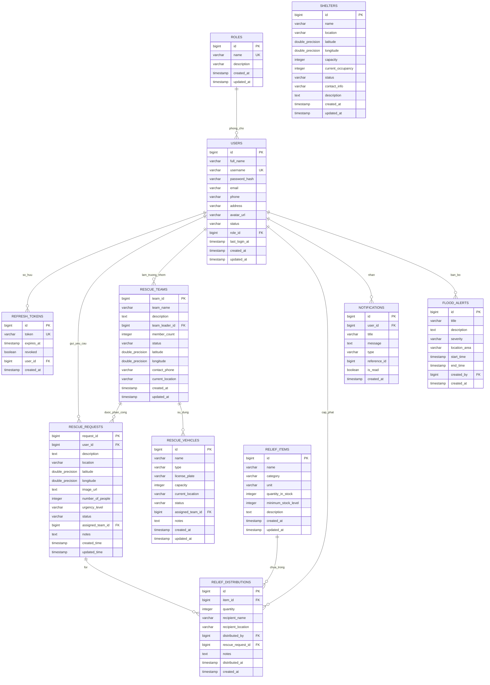
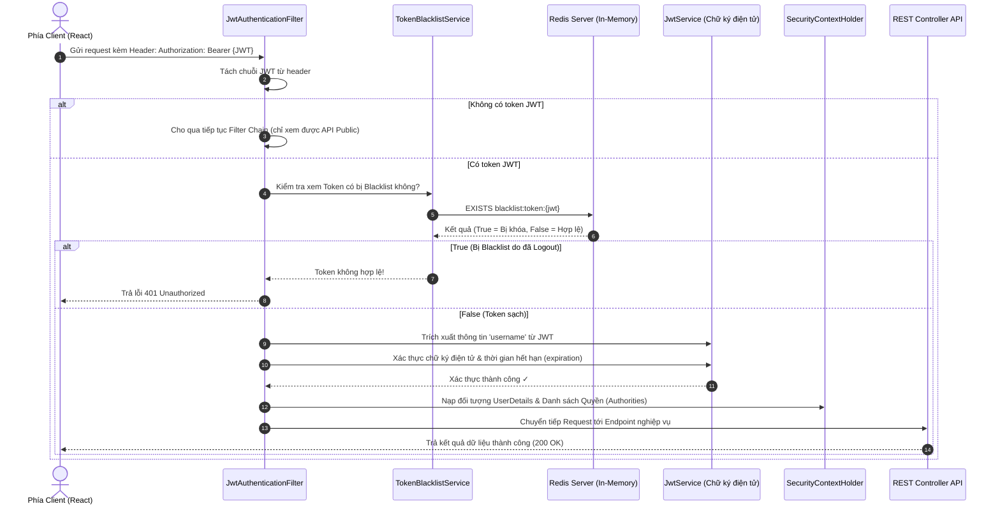
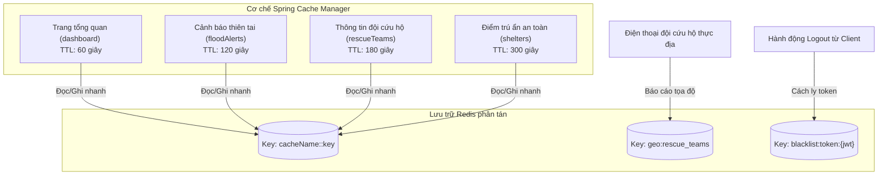
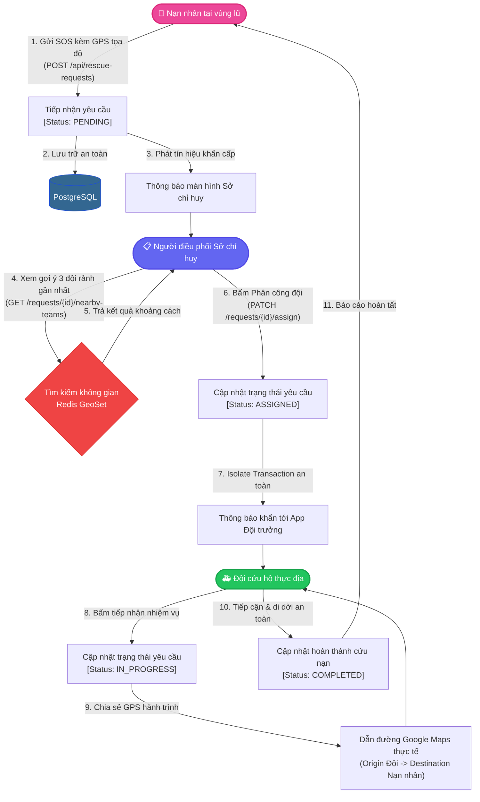
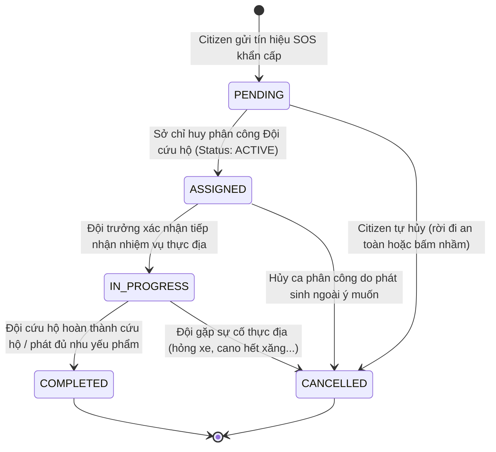

# Hệ Thống Điều Phối Cứu Hộ và Quản Lý Cứu Trợ Lũ Lụt
## Tài Liệu Thiết Kế Hệ Thống (System Design Specification)

> **Dự án**: Flood Rescue Coordination and Relief Management System
> **Phiên bản**: 3.0 | Cập nhật: 19/05/2026
> **Tiêu chuẩn thiết kế**: Enterprise Architecture & High-Performance Routing

---

## 1. Tổng Quan Kiến Trúc (High-Level Architecture)

Hệ thống được thiết kế theo mô hình **Client-Server kiến trúc 3 lớp (3-Tier Architecture)** kết hợp cơ chế đồng bộ không gian thời gian thực và bộ nhớ đệm phân tán để đảm bảo khả năng đáp ứng cao khi xảy ra thiên tai lũ lụt trên diện rộng.



### 1.1 Ngăn Xếp Công Nghệ (Technology Stack)

*   **Tầng Giao Diện**: React 19, Vite 8, TypeScript 5.9, TailwindCSS 3.4 kết hợp CSS nguyên bản tối ưu HSL màu sắc hiện đại, Bản đồ địa lý số tương tác **Leaflet** & **React-Leaflet** tích hợp GPS định vị.
*   **Tầng Ứng Dụng**: Java 17, Spring Boot 3.3.2, Spring Security (JWT-based Stateful Blacklisted Session), Spring Data JPA, Jackson Serialization hỗ trợ đầy đủ API thời gian thực JSR-310 (`LocalDateTime`).
*   **Tầng Dữ Liệu**: PostgreSQL (RDBMS lưu trữ nghiệp vụ, cấu hình dữ liệu chuẩn hóa), Redis 8.6.3 (In-memory lưu cache hệ thống, bộ lọc địa lý không gian **GeoSet** phục vụ dẫn đường thực địa và danh sách đen JWT Token).

---

## 2. Thiết Kế Cơ Sở Dữ Liệu (Database Schema Design)

Cơ sở dữ liệu của hệ thống được chuẩn hóa về dạng chuẩn 3 (3NF) để tránh dư thừa dữ liệu và đảm bảo tính nhất quán giao dịch (ACID) tuyệt đối khi nhiều đội cứu hộ thực địa và người dân gửi tín hiệu SOS đồng thời.

### 2.1 Sơ Đồ Thực Thể Quan Hệ (Entity-Relationship Diagram - ERD)



### 2.2 Đặc Tả Chi Tiết Các Bảng Dữ Liệu (Physical Tables Specification)

#### 1. Bảng `roles` (Vai trò)
Lưu trữ các quyền hạn trong hệ thống để thực thi cơ chế phân quyền RBAC.

| Tên cột | Kiểu dữ liệu | Ràng buộc | Mặc định | Mô tả |
|:---|:---|:---|:---|:---|
| `id` | `BIGINT` | `PRIMARY KEY`, `AUTO_INCREMENT` | | Khóa chính |
| `name` | `VARCHAR(50)` | `UNIQUE`, `NOT NULL` | | Tên vai trò (ADMIN, COORDINATOR, RESCUER, CITIZEN...) |
| `description` | `VARCHAR(255)` | | | Mô tả chi tiết vai trò |
| `created_at` | `TIMESTAMP` | | `NOW()` | Thời gian tạo bản ghi |
| `updated_at` | `TIMESTAMP` | | | Thời gian cập nhật bản ghi |

#### 2. Bảng `users` (Người dùng)
Thông tin chi tiết về toàn bộ thành viên hệ thống (Admin, Điều phối, Đội viên, Người dân).

| Tên cột | Kiểu dữ liệu | Ràng buộc | Mặc định | Mô tả |
|:---|:---|:---|:---|:---|
| `id` | `BIGINT` | `PRIMARY KEY`, `AUTO_INCREMENT` | | Khóa chính |
| `full_name` | `VARCHAR(100)` | `NOT NULL` | | Họ và tên đầy đủ |
| `username` | `VARCHAR(50)` | `UNIQUE`, `NOT NULL` | | Tên đăng nhập |
| `password_hash` | `VARCHAR(255)` | `NOT NULL` | | Mật khẩu mã hóa BCrypt |
| `email` | `VARCHAR(100)` | | | Địa chỉ Email liên hệ |
| `phone` | `VARCHAR(20)` | | | Số điện thoại |
| `address` | `VARCHAR(255)` | | | Địa chỉ thường trú |
| `avatar_url` | `VARCHAR(255)` | | | Đường dẫn ảnh đại diện |
| `status` | `VARCHAR(20)` | | `'ACTIVE'` | Trạng thái (ACTIVE, LOCKED...) |
| `role_id` | `BIGINT` | `FOREIGN KEY` -> `roles(id)` | | Vai trò người dùng |
| `last_login_at` | `TIMESTAMP` | | | Thời gian đăng nhập cuối |
| `created_at` | `TIMESTAMP` | | `NOW()` | Thời gian tạo tài khoản |
| `updated_at` | `TIMESTAMP` | | | Thời gian cập nhật tài khoản |

#### 3. Bảng `refresh_tokens` (Mã làm mới JWT)
Quản lý các chu kỳ gia hạn phiên đăng nhập an toàn của người dùng.

| Tên cột | Kiểu dữ liệu | Ràng buộc | Mặc định | Mô tả |
|:---|:---|:---|:---|:---|
| `id` | `BIGINT` | `PRIMARY KEY`, `AUTO_INCREMENT` | | Khóa chính |
| `token` | `VARCHAR(255)` | `UNIQUE`, `NOT NULL` | | Chuỗi Refresh Token ngẫu nhiên |
| `expires_at` | `TIMESTAMP` | `NOT NULL` | | Thời điểm hết hạn |
| `revoked` | `BOOLEAN` | `NOT NULL` | `FALSE` | Đánh dấu Token đã bị hủy bỏ |
| `user_id` | `BIGINT` | `FOREIGN KEY` -> `users(id)` | | Người sở hữu Token |
| `created_at` | `TIMESTAMP` | | `NOW()` | Thời gian tạo |

#### 4. Bảng `rescue_teams` (Đội cứu hộ)
Quản lý thông tin và tọa độ số của các đơn vị phản ứng nhanh thực hiện cứu hộ thực địa.

| Tên cột | Kiểu dữ liệu | Ràng buộc | Mặc định | Mô tả |
|:---|:---|:---|:---|:---|
| `team_id` | `BIGINT` | `PRIMARY KEY`, `AUTO_INCREMENT` | | Khóa chính |
| `team_name` | `VARCHAR(100)` | `NOT NULL` | | Tên đội phản ứng nhanh |
| `description` | `TEXT` | | | Mô tả chức năng khu vực hoạt động |
| `team_leader_id` | `BIGINT` | `FOREIGN KEY` -> `users(id)` | | Trưởng đội cứu hộ |
| `member_count` | `INTEGER` | | `1` | Số lượng thành viên trong đội |
| `status` | `VARCHAR(20)` | | `'ACTIVE'` | Trạng thái đội (ACTIVE, INACTIVE, ON_DUTY) |
| `latitude` | `DOUBLE PRECISION` | | | Vĩ độ tọa độ hiện tại (GPS) |
| `longitude` | `DOUBLE PRECISION` | | | Kinh độ tọa độ hiện tại (GPS) |
| `contact_phone` | `VARCHAR(20)` | | | Số điện thoại liên hệ khẩn cấp |
| `current_location` | `VARCHAR(255)` | | | Mô tả vị trí địa lý bằng chữ |
| `created_at` | `TIMESTAMP` | | `NOW()` | Thời điểm thành lập |
| `updated_at` | `TIMESTAMP` | | | Cập nhật thông tin gần nhất |

#### 5. Bảng `rescue_requests` (Yêu cầu cứu hộ khẩn cấp)
Tâm điểm dữ liệu tiếp nhận SOS cứu nạn cứu hộ từ người dân.

| Tên cột | Kiểu dữ liệu | Ràng buộc | Mặc định | Mô tả |
|:---|:---|:---|:---|:---|
| `request_id` | `BIGINT` | `PRIMARY KEY`, `AUTO_INCREMENT` | | Khóa chính |
| `user_id` | `BIGINT` | `FOREIGN KEY` -> `users(id)` | | Người dân gửi yêu cầu cứu nạn |
| `description` | `TEXT` | `NOT NULL` | | Mô tả chi tiết tình huống nguy cấp |
| `location` | `VARCHAR(255)` | `NOT NULL` | | Địa điểm xảy ra cứu nạn |
| `latitude` | `DOUBLE PRECISION` | | | Vĩ độ tọa độ chính xác ghim bản đồ |
| `longitude` | `DOUBLE PRECISION` | | | Kinh độ tọa độ chính xác ghim bản đồ |
| `image_url` | `TEXT` | | | Link ảnh hiện trường nạn nhân gửi kèm |
| `number_of_people` | `INTEGER` | | `1` | Số lượng người đang bị cô lập |
| `urgency_level` | `VARCHAR(20)` | | `'MEDIUM'` | Mức khẩn cấp (LOW, MEDIUM, HIGH, CRITICAL) |
| `status` | `VARCHAR(20)` | | `'PENDING'` | Trạng thái (PENDING, ASSIGNED, IN_PROGRESS, COMPLETED...) |
| `assigned_team_id` | `BIGINT` | `FOREIGN KEY` -> `rescue_teams(team_id)` | | Đội cứu hộ được sở chỉ huy điều động |
| `notes` | `TEXT` | | | Ghi chú thêm của điều phối viên |
| `created_time` | `TIMESTAMP` | | `NOW()` | Thời gian nạn nhân bấm SOS |
| `updated_time` | `TIMESTAMP` | | | Thời điểm cập nhật trạng thái gần nhất |

#### 6. Bảng `rescue_vehicles` (Phương tiện cứu hộ)
Danh mục các loại xuồng cano, xe đặc chủng... được cấp phát cho các đội cứu hộ.

| Tên cột | Kiểu dữ liệu | Ràng buộc | Mặc định | Mô tả |
|:---|:---|:---|:---|:---|
| `id` | `BIGINT` | `PRIMARY KEY`, `AUTO_INCREMENT` | | Khóa chính |
| `name` | `VARCHAR(100)` | `NOT NULL` | | Tên gọi của phương tiện |
| `type` | `VARCHAR(50)` | `NOT NULL` | | Phân loại (BOAT, TRUCK, HELICOPTER, AMBULANCE) |
| `license_plate` | `VARCHAR(20)` | | | Biển kiểm soát / Số đăng ký |
| `capacity` | `INTEGER` | | | Sức tải tối đa (số người) |
| `current_location` | `VARCHAR(255)` | | | Nơi đậu phương tiện hiện tại |
| `status` | `VARCHAR(20)` | `NOT NULL` | `'AVAILABLE'` | Trạng thái (AVAILABLE, IN_USE, MAINTENANCE...) |
| `assigned_team_id` | `BIGINT` | `FOREIGN KEY` -> `rescue_teams(team_id)` | | Đội đang sử dụng phương tiện này |
| `notes` | `TEXT` | | | Tình trạng kỹ thuật, hư hỏng... |
| `created_at` | `TIMESTAMP` | | `NOW()` | Thời điểm tạo |
| `updated_at` | `TIMESTAMP` | | | Thời điểm cập nhật |

#### 7. Bảng `relief_items` (Danh mục vật tư cứu trợ)
Danh mục nhu yếu phẩm (Mì tôm, nước sạch, phao cứu sinh, thuốc y tế...) có trong kho trung tâm.

| Tên cột | Kiểu dữ liệu | Ràng buộc | Mặc định | Mô tả |
|:---|:---|:---|:---|:---|
| `id` | `BIGINT` | `PRIMARY KEY`, `AUTO_INCREMENT` | | Khóa chính |
| `name` | `VARCHAR(100)` | `NOT NULL` | | Tên vật tư nhu yếu phẩm |
| `category` | `VARCHAR(50)` | `NOT NULL` | | Phân loại (FOOD, WATER, MEDICAL, CLOTHING...) |
| `unit` | `VARCHAR(20)` | | | Đơn vị tính (Thùng, Chai, Bộ, Hộp...) |
| `quantity_in_stock` | `INTEGER` | `NOT NULL` | `0` | Số lượng tồn kho khả dụng hiện hữu |
| `minimum_stock_level` | `INTEGER` | | `10` | Định mức cảnh báo cạn kho khẩn cấp |
| `description` | `TEXT` | | | Mô tả chi tiết cách bảo quản |
| `created_at` | `TIMESTAMP` | | `NOW()` | Ngày thêm vào kho |
| `updated_at` | `TIMESTAMP` | | | Cập nhật kho gần nhất |

#### 8. Bảng `relief_distributions` (Nhật ký phân phát cứu trợ)
Lịch sử chi tiết cấp phát nhu yếu phẩm cho người dân cứu nạn.

| Tên cột | Kiểu dữ liệu | Ràng buộc | Mặc định | Mô tả |
|:---|:---|:---|:---|:---|
| `id` | `BIGINT` | `PRIMARY KEY`, `AUTO_INCREMENT` | | Khóa chính |
| `item_id` | `BIGINT` | `FOREIGN KEY` -> `relief_items(id)` | | Mặt hàng được phát |
| `quantity` | `INTEGER` | `NOT NULL` | | Số lượng thực phát |
| `recipient_name` | `VARCHAR(100)` | | | Tên người đại diện nhận |
| `recipient_location` | `VARCHAR(255)` | | | Điểm phát hàng |
| `distributed_by` | `BIGINT` | `FOREIGN KEY` -> `users(id)` | | Đội viên / Nhân viên kho thực hiện phát |
| `rescue_request_id` | `BIGINT` | `FOREIGN KEY` -> `rescue_requests(request_id)` | | Phân phát theo ca cứu trợ cụ thể |
| `notes` | `TEXT` | | | Ghi chú thêm |
| `distributed_at` | `TIMESTAMP` | | `NOW()` | Thời điểm giao nhận hàng |
| `created_at` | `TIMESTAMP` | | `NOW()` | Ghi nhận hệ thống |

#### 9. Bảng `notifications` (Thông báo hệ thống)
Hệ thống báo tin thời gian thực đa kênh (SOS, Cập nhật tọa độ, Phân công công việc).

| Tên cột | Kiểu dữ liệu | Ràng buộc | Mặc định | Mô tả |
|:---|:---|:---|:---|:---|
| `id` | `BIGINT` | `PRIMARY KEY`, `AUTO_INCREMENT` | | Khóa chính |
| `user_id` | `BIGINT` | `FOREIGN KEY` -> `users(id)` | | Người nhận thông báo |
| `title` | `VARCHAR(255)` | `NOT NULL` | | Tiêu đề thông báo |
| `message` | `TEXT` | `NOT NULL` | | Chi tiết nội dung tin nhắn |
| `type` | `VARCHAR(50)` | `NOT NULL` | | Loại (SOS_ASSIGNMENT, ALERT, MESSAGE...) |
| `reference_id` | `BIGINT` | | | Liên kết ID nhiệm vụ/đội có liên quan |
| `is_read` | `BOOLEAN` | `NOT NULL` | `FALSE` | Trạng thái đọc tin |
| `created_at` | `TIMESTAMP` | | `NOW()` | Thời gian phát đi thông báo |

#### 10. Bảng `shelters` (Điểm an toàn lánh nạn)
Danh sách các trường học, nhà cao tầng kiên cố làm điểm trú ẩn cho người dân tránh lũ.

| Tên cột | Kiểu dữ liệu | Ràng buộc | Mặc định | Mô tả |
|:---|:---|:---|:---|:---|
| `id` | `BIGINT` | `PRIMARY KEY`, `AUTO_INCREMENT` | | Khóa chính |
| `name` | `VARCHAR(255)` | `NOT NULL` | | Tên điểm trú ẩn an toàn |
| `location` | `VARCHAR(255)` | `NOT NULL` | | Địa chỉ vị trí điểm trú ẩn |
| `latitude` | `DOUBLE PRECISION` | | | Vĩ độ địa lý điểm ghim bản đồ |
| `longitude` | `DOUBLE PRECISION` | | | Kinh độ địa lý điểm ghim bản đồ |
| `capacity` | `INTEGER` | `NOT NULL` | | Sức chứa tối đa (số người ở) |
| `current_occupancy` | `INTEGER` | | `0` | Số người đang lánh nạn thực tế |
| `status` | `VARCHAR(20)` | | `'OPEN'` | Trạng thái điểm trú ẩn (OPEN, FULL, CLOSED) |
| `contact_info` | `VARCHAR(100)` | | | Số điện thoại quản lý trạm lánh nạn |
| `description` | `TEXT` | | | Chỉ dẫn lối vào an toàn |
| `created_at` | `TIMESTAMP` | | `NOW()` | Ngày đưa vào hoạt động |
| `updated_at` | `TIMESTAMP` | | | Cập nhật chỉ số |

#### 11. Bảng `flood_alerts` (Cảnh báo lũ lụt thiên tai)
Hệ thống phát thông báo thiên tai khẩn cấp toàn dân.

| Tên cột | Kiểu dữ liệu | Ràng buộc | Mặc định | Mô tả |
|:---|:---|:---|:---|:---|
| `id` | `BIGINT` | `PRIMARY KEY`, `AUTO_INCREMENT` | | Khóa chính |
| `title` | `VARCHAR(255)` | `NOT NULL` | | Tiêu đề cảnh báo (ví dụ: Lũ báo động 3 sông Thu Bồn) |
| `description` | `TEXT` | | | Khuyến cáo chi tiết cho người dân tránh bão |
| `severity` | `VARCHAR(20)` | `NOT NULL` | | Mức độ nguy hại (INFO, WARNING, EMERGENCY) |
| `location_area` | `VARCHAR(255)` | `NOT NULL` | | Khu vực nằm trong vùng ảnh hưởng |
| `start_time` | `TIMESTAMP` | | | Thời gian bão lũ dự kiến bắt đầu |
| `end_time` | `TIMESTAMP` | | | Thời gian kết thúc dự báo |
| `created_by` | `BIGINT` | `FOREIGN KEY` -> `users(id)` | | Người phát hành cảnh báo |
| `created_at` | `TIMESTAMP` | | `NOW()` | Thời điểm phát tin |

### 2.3 Chiến Lược Đánh Chỉ Mục & Tối Ưu Hóa Truy Vấn Vật Lý (Physical Indexing Strategy)

Để phục vụ truy xuất dữ liệu bản đồ cực nhanh trên nền PostgreSQL, hệ thống thiết kế các chỉ mục (Indexes) chiến lược:

```sql
-- 1. Index duy nhất để tăng tốc độ Đăng nhập & Xác thực JWT
CREATE UNIQUE INDEX idx_users_username ON users(username);

-- 2. Index liên kết khóa ngoại phục vụ lọc nhanh yêu cầu của từng người dùng
CREATE INDEX idx_rescue_requests_user ON rescue_requests(user_id);
CREATE INDEX idx_rescue_requests_status ON rescue_requests(status);

-- 3. Composite Index phục vụ lọc và tìm kiếm vật tư có mức tồn kho thấp hơn ngưỡng an toàn
CREATE INDEX idx_relief_items_stock_check ON relief_items(quantity_in_stock, minimum_stock_level);

-- 4. Spatial Index (B-Tree Composite phục vụ Haversine Fallback tính toán khoảng cách)
CREATE INDEX idx_rescue_teams_coordinates ON rescue_teams(latitude, longitude) 
    WHERE status = 'ACTIVE';
CREATE INDEX idx_shelters_coordinates ON shelters(latitude, longitude);
```

### 2.4 Quản Lý Dữ Liệu Tọa Độ Không Gian với Redis GeoSet

Khi các đội cứu hộ thực địa di chuyển liên tục, việc truy vấn PostgreSQL sẽ gặp hiện tượng nghẽn I/O. Do đó, hệ thống đồng bộ thời gian thực tọa độ của các Đội cứu hộ hoạt động vào **Redis GeoSet** dưới khóa:
*   **Key**: `geo:rescue_teams`
*   **Member**: `team_id`
*   **Score**: Tọa độ địa lý mã hóa sang chuỗi 52-bit Geohash.

Các câu lệnh cơ sở dữ liệu Redis được tối ưu để tìm ra Đội cứu hộ rảnh gần nạn nhân nhất trong bán kính $100km$ với độ trễ cực thấp (< 2ms):
```bash
# Thêm tọa độ Đội Sông Hàn (Kinh độ 108.2300, Vĩ độ 16.0600)
GEOADD geo:rescue_teams 108.2300 16.0600 "team:1"

# Truy tìm các đội cứu hộ trong bán kính 15km quanh nạn nhân ghim vị trí (108.2345, 15.8234)
GEORADIUS geo:rescue_teams 108.2345 15.8234 15 km WITHDIST WITHCOORD ASC LIMIT 5
```

---

## 3. Cấu Trúc Thư Mục & Mã Nguồn (Codebase Structure)

Dự án tuân thủ cấu trúc phân rã module rõ ràng giữa phía Client (React Single Page Application) và phía Server (Spring Boot Restful API).

```
flood-rescue-system/
├── client/                          # Frontend React SPA
│   ├── public/                      # Static assets
│   └── src/
│       ├── api/
│       │   └── http.ts              # Cấu hình Axios Instance, tự động đính kèm Token JWT Bearer
│       ├── services/                # Tầng gọi các REST API endpoint chuẩn
│       │   ├── apiService.ts        # Toàn bộ API CRUD (Yêu cầu, Phương tiện, Điểm lánh nạn...)
│       │   ├── authService.ts       # Đăng nhập, đăng ký, làm mới token và đăng xuất
│       │   └── sessionStorage.ts    # Đọc ghi accessToken/refreshToken
│       ├── pages/                   # Giao diện người dùng (Màn hình chức năng)
│       │   ├── LoginPage.tsx        # Trang đăng nhập HSL Theme
│       │   ├── RegisterPage.tsx     # Đăng ký tài khoản người dân
│       │   ├── DashboardPage.tsx    # Bảng phân tích chỉ số SOS toàn tỉnh
│       │   ├── MapPage.tsx          # Bản đồ tác chiến số GIS Leaflet, xem vị trí hiện tại
│       │   ├── RescueRequestsPage.tsx # Gửi SOS & Sửa vị trí bản đồ cho Citizen / Điều phối
│       │   ├── TeamsPage.tsx        # Quản lý đội phản ứng nhanh thực địa
│       │   ├── VehiclesPage.tsx     # Cấp phát phương tiện xuồng cano, xe đặc chủng
│       │   ├── SheltersPage.tsx     # Ghim điểm lánh nạn an toàn trên bản đồ tương tác
│       │   ├── AlertsPage.tsx       # Công bố tình trạng ngập lụt khẩn cấp vùng hạ lưu
│       │   ├── ReliefPage.tsx       # Phân kho nhu yếu phẩm & giao nhận lương thực
│       │   └── AdminUsersPage.tsx   # Cấp vai trò Admin, Điều phối, Đội viên cho tài khoản
│       ├── components/              # Các UI Components tái sử dụng (Bản đồ chọn điểm, Modal...)
│       └── main.tsx                 # Điểm khởi chạy chính của Client
│
├── server/                          # Backend Spring Boot API Server
│   ├── src/main/java/com/floodrescue/floodrescuesystem/
│   │   ├── config/                  # Cấu hình hạt nhân hệ thống
│   │   │   ├── RedisConfig.java     # Cấu hình Redis Cache Manager & Jackson Time Module
│   │   │   └── OpenApiConfig.java   # Tài liệu tài nguyên API Swagger UI
│   │   ├── controller/              # Định tuyến REST APIs tiếp nhận từ Frontend
│   │   │   ├── AuthController.java  # Đăng nhập và xác thực phiên
│   │   │   ├── RescueRequestController.java # Điểm ghim SOS, điều phối đội gần nhất
│   │   │   ├── RescueTeamController.java # Cập nhật tọa độ thực địa của đội viên
│   │   │   └── ...                  # Cảnh báo bão, Kho bãi vật tư, Quản lý tài nguyên
│   │   ├── service/                 # Tầng xử lý logic nghiệp vụ chính
│   │   │   ├── RescueRequestService.java # Nghiệp vụ lưu SOS, phân công đội trưởng
│   │   │   ├── NotificationService.java  # Thông báo độc lập (REQUIRES_NEW) phòng ngừa Rollback
│   │   │   ├── NearbyTeamService.java   # Thuật toán tìm kiếm không gian Redis Geo + Haversine fallback
│   │   │   └── ...                  # Quản lý hàng dự trữ, phân xe đặc chủng
│   │   ├── repository/              # Tầng tương tác Cơ sở dữ liệu PostgreSQL
│   │   ├── entity/                  # Các đối tượng thực thể ánh xạ JPA Hibernate
│   │   ├── dto/                     # Chuyển đổi dữ liệu Request/Response chuẩn
│   │   └── security/                # Lá chắn bảo mật hệ thống
│   │       ├── SecurityConfig.java  # Phân quyền Endpoint, chặn CORS và mở Swagger UI
│   │       ├── JwtService.java      # Tạo lập, giải mã và trích xuất thông tin chữ ký JWT
│   │       ├── JwtAuthenticationFilter.java # Chốt chặn kiểm tra Token hợp lệ ở mỗi Request
│   │       └── CustomUserDetailsService.java # Nạp thông tin người dùng từ CSDL vào Security Context
│   └── pom.xml                      # Quản lý thư viện Maven Backend
└── test_data.sql                    # Script chèn dữ liệu khởi tạo mẫu CSDL
```

---

## 4. Đặc Tả RESTful API Đầy Đủ (API Specifications)

### 4.1 Phân Hệ Xác Thực & Quản Trị Phiên (`/api/auth`)

| Phương thức | Đường dẫn API | Mô tả nghiệp vụ | Yêu cầu quyền hạn |
|:---|:---|:---|:---|
| `POST` | `/api/auth/register` | Đăng ký tài khoản người dân mới | Công khai (Public) |
| `POST` | `/api/auth/login` | Đăng nhập hệ thống, nhận Access Token & Refresh Token | Công khai (Public) |
| `POST` | `/api/auth/refresh` | Làm mới Access Token đã hết hạn bằng Refresh Token | Công khai (Public) |
| `POST` | `/api/auth/logout` | Đăng xuất, ghi danh sách đen JWT hiện hành vào Redis | Đã đăng nhập |

### 4.2 Phân Hệ Yêu Cầu Cứu Hộ Khẩn Cấp (`/api/rescue-requests`)

| Phương thức | Đường dẫn API | Mô tả nghiệp vụ | Yêu cầu quyền hạn |
|:---|:---|:---|:---|
| `POST` | `/api/rescue-requests` | Gửi yêu cầu SOS kèm tọa độ và hình ảnh hiện trường thực | `CITIZEN` |
| `GET` | `/api/rescue-requests/my-requests` | Xem danh sách các yêu cầu SOS cá nhân đã gửi | `CITIZEN` |
| `PATCH` | `/api/rescue-requests/{id}/confirm-rescued` | Người dân xác nhận đã được đội cứu hộ tiếp cận và di dời | `CITIZEN` |
| `PATCH` | `/api/rescue-requests/{id}/location` | Gửi tín hiệu tọa độ định vị GPS thay đổi từ điện thoại của nạn nhân | `CITIZEN` |
| `GET` | `/api/rescue-requests` | Lấy toàn bộ danh sách SOS đang có trên địa bàn | `ADMIN`, `COORDINATOR` |
| `GET` | `/api/rescue-requests/{id}` | Xem chi tiết thông tin và bản đồ tọa độ 1 ca cứu nạn cụ thể | Mọi tài khoản |
| `GET` | `/api/rescue-requests/status/{status}` | Lọc danh sách SOS theo trạng thái (PENDING, IN_PROGRESS...) | `COORDINATOR`, `ADMIN` |
| `GET` | `/api/rescue-requests/{id}/nearby-teams` | **Gợi ý 3-5 Đội cứu hộ ACTIVE gần nhất sử dụng Redis Geo + Haversine** | `COORDINATOR`, `ADMIN` |
| `PATCH` | `/api/rescue-requests/{id}/assign` | **Phân công đội cứu hộ thực hiện giải cứu nạn nhân (Sở chỉ huy điều phối)** | `COORDINATOR`, `ADMIN` |
| `PATCH` | `/api/rescue-requests/{id}/status` | Cập nhật trạng thái xử lý ca SOS | Đội viên cứu hộ, Ban chỉ huy |
| `PATCH` | `/api/rescue-requests/{id}/urgency` | Cập nhật mức độ khẩn cấp (CRITICAL, HIGH...) sau khi xác thực | `COORDINATOR`, `ADMIN` |
| `DELETE` | `/api/rescue-requests/{id}` | Xóa yêu cầu SOS bị spam hoặc sai lệch | `ADMIN` |

### 4.3 Phân Hệ Đội Cứu Hộ & Phương Tiện Can Tác

| Phương thức | Đường dẫn API | Mô tả nghiệp vụ | Yêu cầu quyền hạn |
|:---|:---|:---|:---|
| `GET` | `/api/rescue-teams` | Xem danh sách các đội cứu hộ đang hoạt động (Cached 180s) | Mọi tài khoản |
| `POST` | `/api/rescue-teams` | Thành lập đội cứu hộ mới | `ADMIN`, `COORDINATOR` |
| `PUT` | `/api/rescue-teams/{id}` | Cập nhật thông tin thành viên, thông tin liên lạc của đội | `COORDINATOR`, `ADMIN` |
| `PATCH` | `/api/rescue-teams/{id}/location` | Cập nhật tọa độ thực địa hiện tại của đội (GPS chia sẻ tự động) | Trưởng đội cứu hộ |
| `DELETE` | `/api/rescue-teams/{id}` | Giải tán đội cứu hộ | `ADMIN` |
| `GET` | `/api/vehicles` | Xem danh sách các phương tiện cứu hộ (cano, xe tải...) | Mọi tài khoản |
| `POST` | `/api/vehicles` | Nhập thêm phương tiện cứu hộ mới | `COORDINATOR`, `ADMIN` |
| `PATCH` | `/api/vehicles/{id}/assign-team` | Giao xe/xuồng cano cho một đội phản ứng nhanh cụ thể quản lý | `COORDINATOR`, `ADMIN` |

### 4.4 Phân Hệ Trạm Trú Ẩn An Toàn (`/api/shelters`)

| Phương thức | Đường dẫn API | Mô tả nghiệp vụ | Yêu cầu quyền hạn |
|:---|:---|:---|:---|
| `GET` | `/api/shelters` | Lấy danh sách điểm trú ẩn kèm sức chứa và số chỗ còn trống (Cached 300s) | Mọi tài khoản |
| `POST` | `/api/shelters` | Tạo lập một điểm trú ẩn an toàn mới trên bản đồ số | `COORDINATOR`, `ADMIN`, `MANAGER` |
| `PUT` | `/api/shelters/{id}` | Cập nhật số người đang lánh nạn thực tế tại trạm | `MANAGER`, `COORDINATOR` |
| `DELETE` | `/api/shelters/{id}` | Xóa điểm trú ẩn khỏi danh sách bản đồ | `ADMIN` |

### 4.5 Phân Hệ Cứu Trợ Logistics (`/api/relief`)

| Phương thức | Đường dẫn API | Mô tả nghiệp vụ | Yêu cầu quyền hạn |
|:---|:---|:---|:---|
| `GET` | `/api/relief/items` | Xem tồn kho các loại hàng hóa nhu yếu phẩm dự trữ trong kho | Mọi tài khoản |
| `POST` | `/api/relief/items` | Nhập kho thêm hàng hóa nhu yếu phẩm mới | `MANAGER`, `ADMIN` |
| `GET` | `/api/relief/items/low-stock` | Cảnh báo danh sách các mặt hàng đã cạn kiệt dưới mức an toàn | `MANAGER`, `ADMIN` |
| `POST` | `/api/relief/distributions` | Thực hiện xuất kho cấp phát nhu yếu phẩm đến vùng lụt | Đội viên cứu hộ, Thủ kho |

---

## 5. Cơ Chế Bảo Mật & Phân Quyền (Security & Access Control)

### 5.1 Kiến Trúc Bộ Lọc Xác Thực JWT (JWT Filter Architecture)

Hệ thống bảo vệ tài nguyên thông qua lá chắn **Spring Security Filter Chain**, xác thực phi trạng thái (Stateless) ở từng yêu cầu HTTP riêng biệt.



### 5.2 Cơ Chế JWT Token

*   **Thuật toán mã hóa chữ ký**: **HS512** (chữ ký bảo mật cao với khóa bí mật tối thiểu 512-bit).
*   **Thời gian sống của Access Token (Access Token TTL)**: $15$ phút ($900.000$ milliseconds) nhằm hạn chế rủi ro lộ lọt khóa.
*   **Thời gian sống của Refresh Token (Refresh Token TTL)**: $7$ ngày ($604.800.000$ milliseconds) giúp người dùng giữ trạng thái đăng nhập thuận tiện.
*   **Danh sách Claims trong Token**: `sub` (Tên đăng nhập), `role` (Quyền hạn), `iat` (Thời điểm phát hành), `exp` (Thời điểm hết hạn).

### 5.3 Ma Trận Phân Quyền Theo Vai Trò (Role-Based Access Control - RBAC Matrix)

| Chức năng nghiệp vụ | `ADMIN` | `COORDINATOR` | `MANAGER` | `RESCUER` | `CITIZEN` |
|:---|:---:|:---:|:---:|:---:|:---:|
| Phê duyệt / Quản lý tài khoản | **X** | | | | |
| Tiếp nhận SOS / Xem toàn bản đồ | **X** | **X** | **X** | **X** | |
| Gợi ý đội gần nhất & Điều phối | **X** | **X** | | | |
| Quản lý danh mục Đội cứu hộ | **X** | **X** | | | |
| Nhập kho nhu yếu phẩm & Cảnh báo | **X** | | **X** | | |
| Thực hiện giải cứu nạn nhân | | | | **X** | |
| Gửi tín hiệu SOS khẩn cấp | | | | | **X** |
| Chia sẻ tọa độ di động thời gian thực | | | | **X** | **X** |

---

## 6. Chiến Lược Bộ Nhớ Đệm & Đồng Bộ Realtime (Redis Integration)

Hệ thống tích hợp Redis để xử lý ba tác vụ cốt lõi có tần suất đọc/ghi cực kỳ lớn: **API Caching**, **Geo Location Tracking** và **Session Blacklist**.



### 6.1 Chính Sách Hủy Bộ Nhớ Đệm Nhất Quán (Cache Eviction Triggers)

Để đảm bảo tính nhất quán cao nhất của dữ liệu khi xảy ra các thao tác ghi (Create / Update / Delete), hệ thống cấu hình các bộ lọc tự động xóa vùng cache tương ứng:

*   **Cache `floodAlerts`**: Tự động xóa sạch toàn bộ khóa khi Ban chỉ huy thực hiện công bố cảnh báo khẩn cấp mới (`@CacheEvict(value = "floodAlerts", allEntries = true)`).
*   **Cache `rescueTeams`**: Xóa sạch cache khi có sự thay đổi về nhân sự đội cứu hộ, đổi xe, hoặc giải tán đội.
*   **Cache `shelters`**: Xóa cache điểm lánh nạn khi quản lý cập nhật lại số lượng người lánh nạn thực tế.

---

## 7. Quy Trình Nghiệp Vụ Cốt Lõi (Core Workflows)

### 7.1 Luồng Điều Phối Cứu Hộ Thời Gian Thực

Quy trình phối hợp khép kín và an toàn giữa Nạn nhân, Sở chỉ huy điều phối và Lực lượng cứu hộ thực địa:



### 7.2 Biểu Đồ Trạng Thái Của Yêu Cầu Cứu Hộ (Rescue Request State Machine)



---

## 8. Cấu Hình Môi Trường Thực Thi (Deployment & Environments)

### 8.1 Tập Tin Cấu Hình Hạt Nhân (`application.properties`)

```properties
# 1. Cấu hình Cổng Dịch Vụ
server.port=8080

# 2. Cấu hình Cơ sở dữ liệu chính PostgreSQL
spring.datasource.url=jdbc:postgresql://localhost:5432/flood_rescue_db
spring.datasource.username=postgres
spring.datasource.password=1234
spring.datasource.driver-class-name=org.postgresql.Driver

# 3. Cấu hình tầng ORM JPA / Hibernate
spring.jpa.hibernate.ddl-auto=update
spring.jpa.show-sql=true
spring.jpa.properties.hibernate.format_sql=true
spring.jpa.properties.hibernate.dialect=org.hibernate.dialect.PostgreSQLDialect

# 4. Cấu hình cổng kết nối Redis phân tán
spring.data.redis.host=localhost
spring.data.redis.port=6379
spring.data.redis.password=

# 5. Khóa chữ ký điện tử an toàn JWT (Tối thiểu 64 ký tự chuẩn mã hóa HS512)
app.jwt.secret=9a76e8d2b3c4f5e6d7c8b9a0123456789abcdef0123456789abcdef0123456789abcde
# Thời hạn Access Token: 15 phút (900.000 ms)
app.jwt.access-expiration=900000
# Thời hạn Refresh Token: 7 ngày (604.800.000 ms)
app.jwt.refresh-expiration=604800000

# 6. Định mức thời gian sống Cache Hệ thống (Tính bằng Giây)
app.cache.ttl.dashboard=60
app.cache.ttl.shelters=300
app.cache.ttl.flood-alerts=120
app.cache.ttl.rescue-teams=180

# 7. Tài liệu API Swagger UI
springdoc.swagger-ui.path=/swagger-ui.html
springdoc.api-docs.path=/v3/api-docs
```

### 8.2 Quy Trình Khởi Chạy Hệ Thống Thực Tế

Hệ thống được vận hành nhanh thông qua môi trường dòng lệnh PowerShell trên Windows:

```powershell
# Bước 1: Khởi động cơ sở dữ liệu PostgreSQL (Cổng mặc định: 5432)
# Đảm bảo Database 'flood_rescue_db' đã được tạo lập thành công.

# Bước 2: Kích hoạt dịch vụ máy chủ bộ nhớ đệm Redis
Start-Process "redis\Redis-8.6.3-Windows-x64-msys2\redis-server.exe" -WindowStyle Hidden
Write-Host "Redis Server đang chạy ngầm tại cổng 6379..." -ForegroundColor Green

# Bước 3: Biên dịch và chạy máy chủ Spring Boot Backend
cd server
./mvnw spring-boot:run
# Backend sẽ khởi chạy và lắng nghe tại cổng http://localhost:8080

# Bước 4: Khởi động máy chủ nhà phát triển Frontend React + Vite
cd ../client
npm run dev
# Frontend sẽ được kích hoạt tại cổng http://localhost:5173
```

---

## 9. Thống Kê Thư Viện Lõi Sử Dụng (System Dependencies)

| Thư viện | Mục đích sử dụng | Lợi ích tối ưu |
|:---|:---|:---|
| `spring-boot-starter-data-jpa` | Quản trị tầng giao tiếp CSDL chính | Tự động hóa ánh xạ ORM, kiểm soát Transaction an toàn |
| `spring-boot-starter-security` | Thiết lập chốt chặn phân quyền RBAC | Bảo mật tài nguyên hệ thống, chống tấn công tiêm nhiễm |
| `spring-boot-starter-data-redis` | Bộ nhớ đệm API, cấu trúc GeoSet | Tăng tốc độ truy xuất, giảm thời gian xử lý khoảng cách |
| `jackson-datatype-jsr310` | Định dạng và Serialization đối tượng Thời gian | Đảm bảo truyền nhận chuỗi thời gian không bị sai lệch múi giờ |
| `springdoc-openapi` | Tự động sinh tài liệu tài nguyên API | Hỗ trợ lập trình viên Frontend tích hợp và kiểm thử dễ dàng |
| `jjwt (0.12.6)` | Tạo lập và kiểm chứng chữ ký số JWT | Mã hóa thông tin vai trò gọn nhẹ, không trạng thái trên server |
